🎓 Graduation Project: Shatably App

A mobile application that connects clients with handymen to complete house-related tasks.

✨ Key Features

User authentication (Login, Register, Password Reset, Location-based access)

Clean architecture using MVVM

State management with Cubit

RESTful API integration using Dio

Secure payments with Stripe

Full e-commerce module (Shop, Cart, Buy Later)

AI-powered features for home design assistance

🤖 AI Tools

AI Chat Assistant for interactive design advice

AI Image Generator for personalized design inspiration

🔒 Source code is private. This repository is for showcase purposes only.

  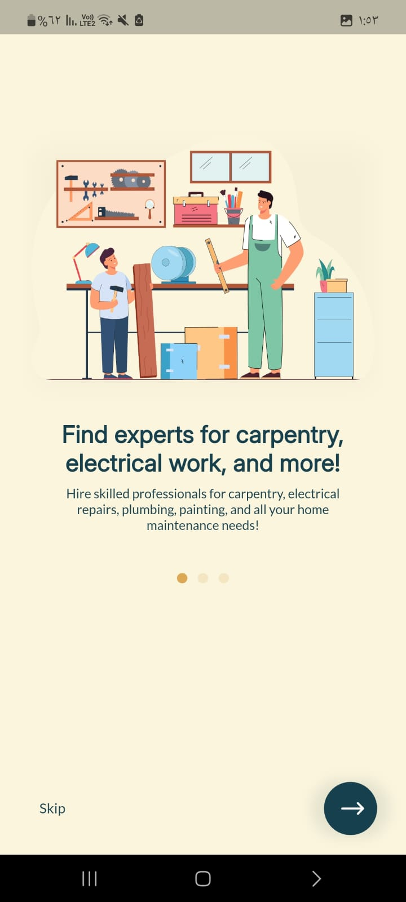
  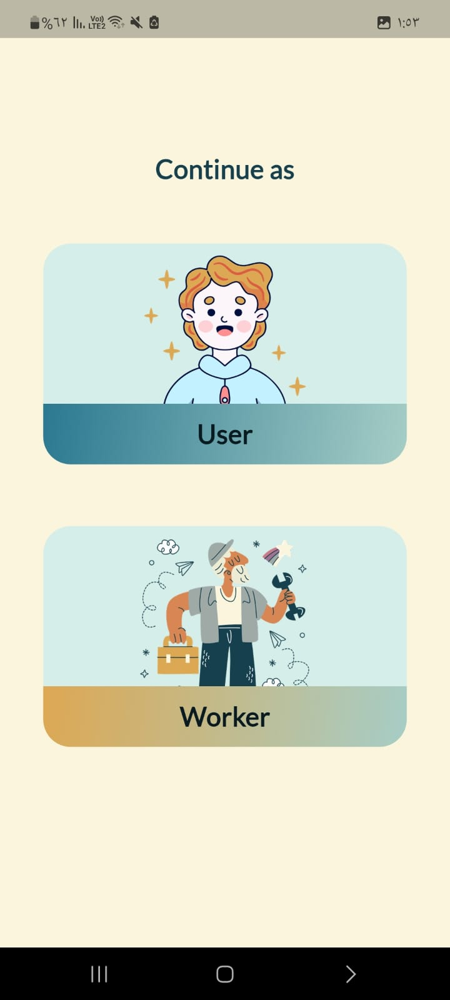

  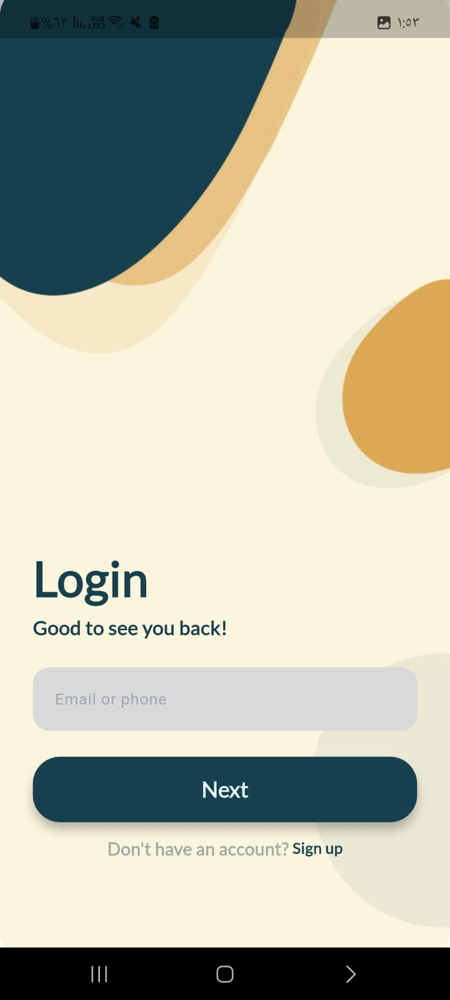
  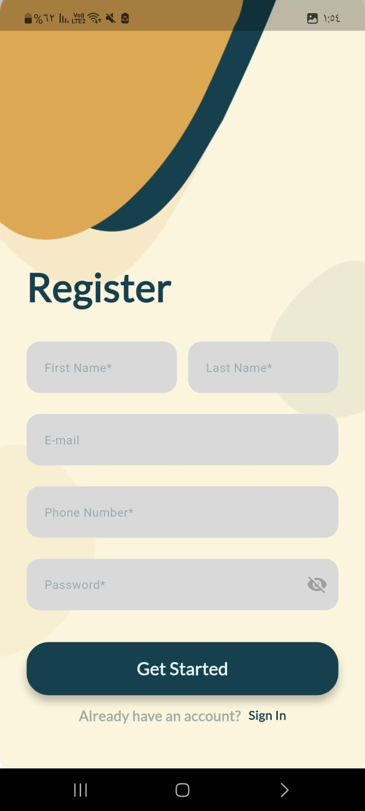

  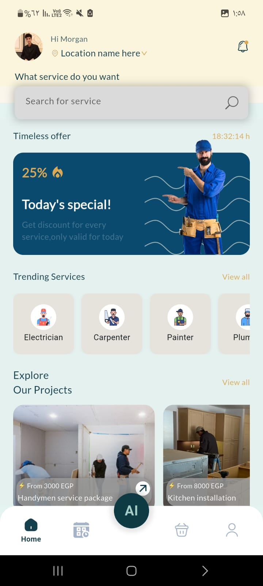
  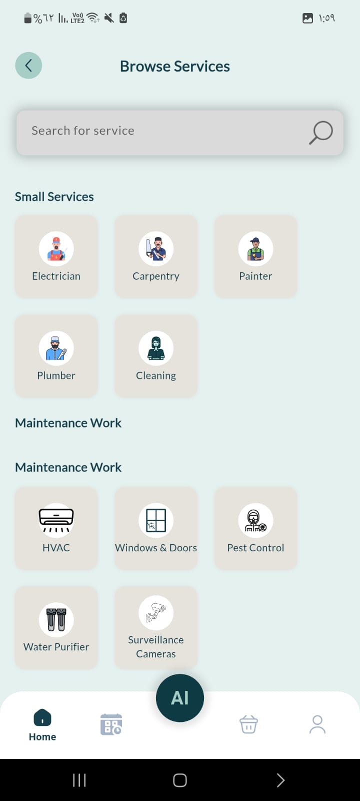

  
  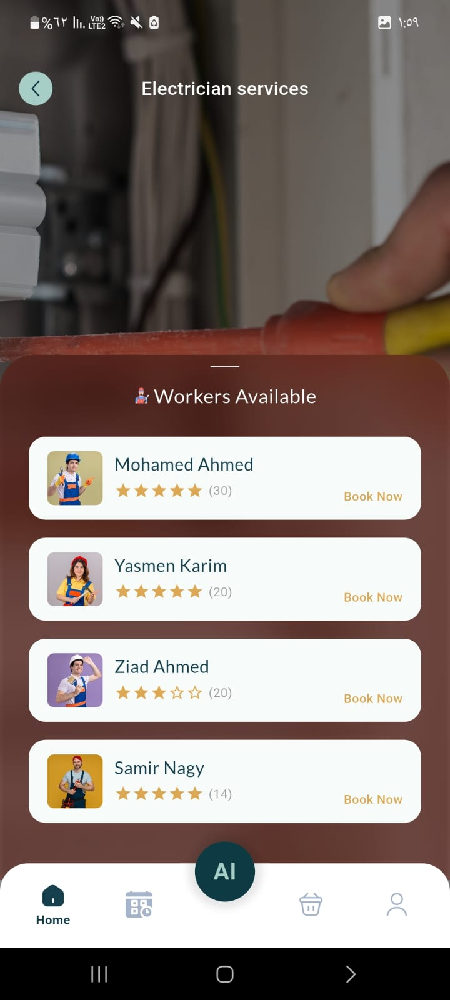

  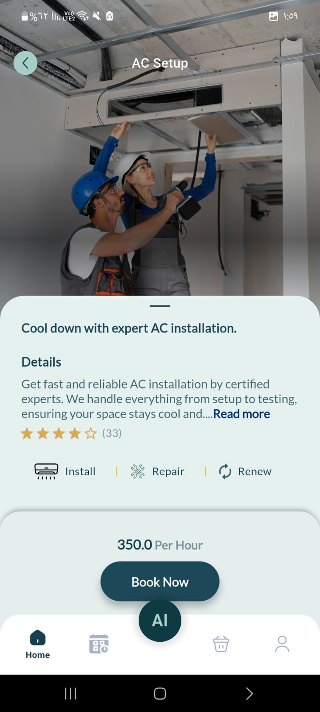

  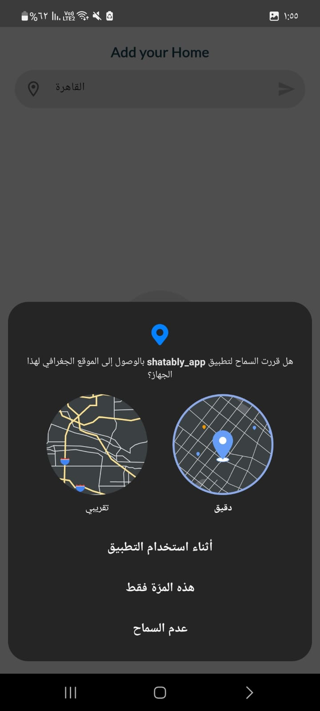
  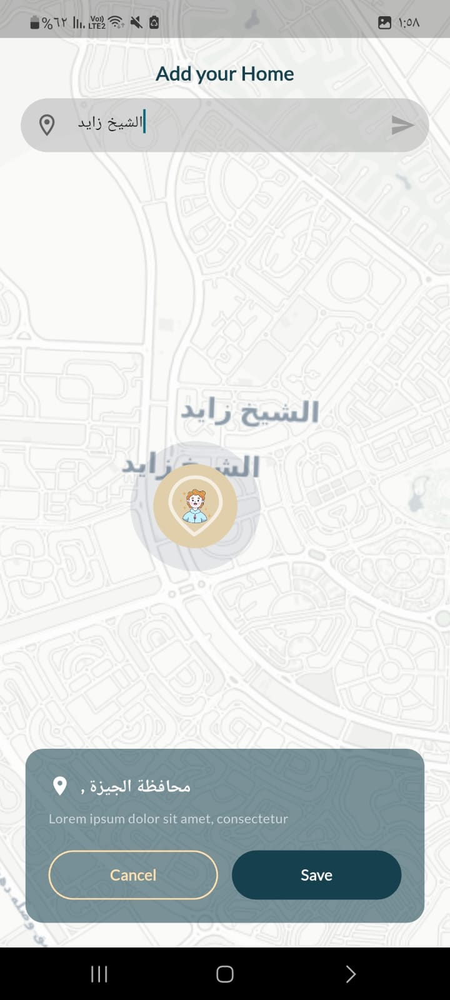

  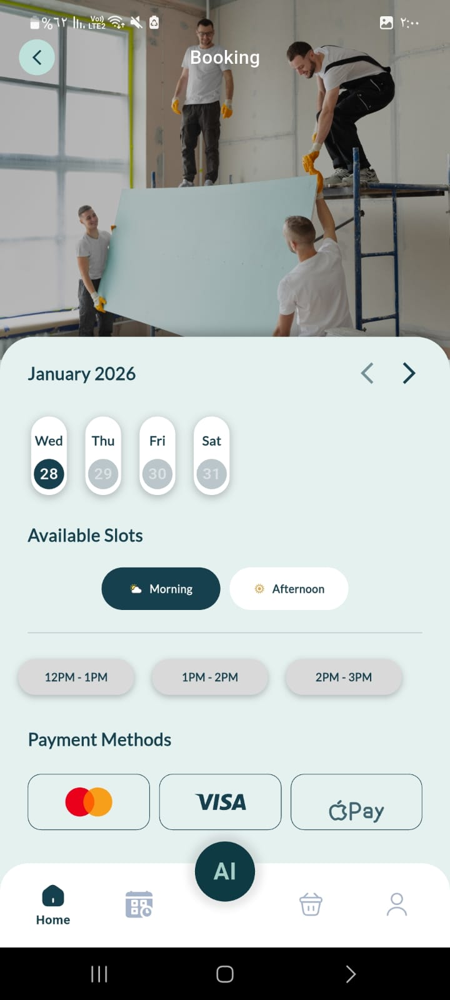
  

  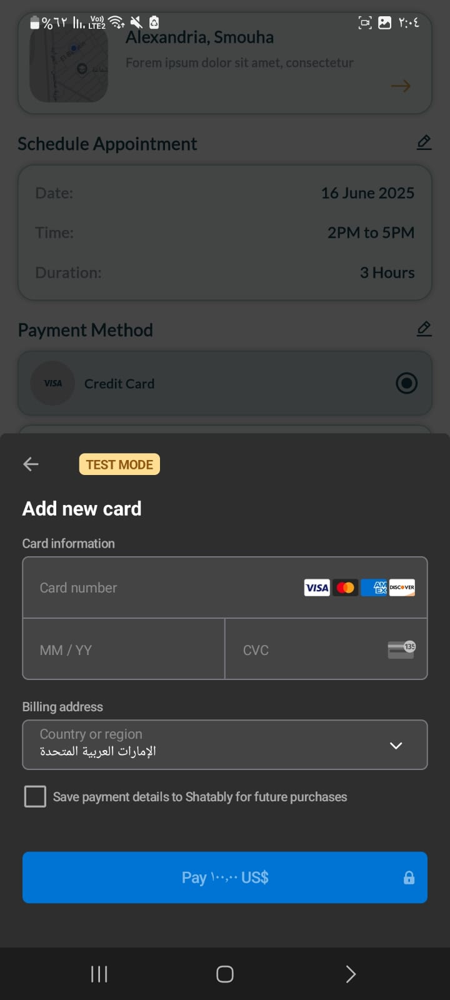
  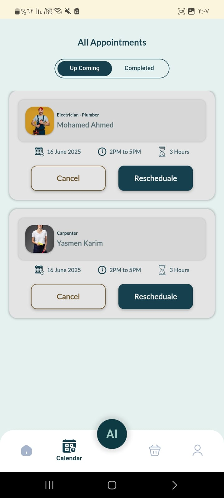

  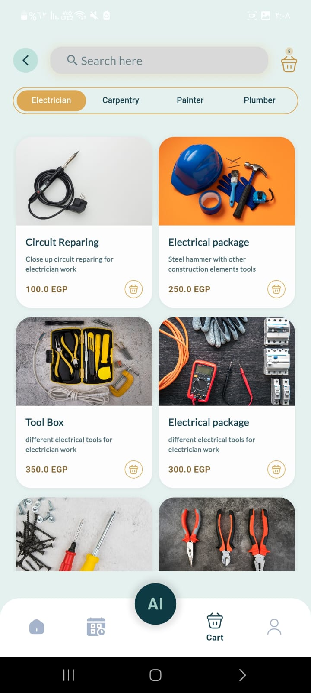
  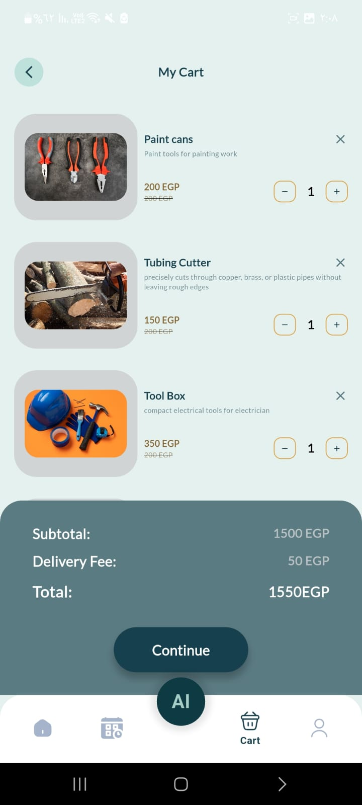

  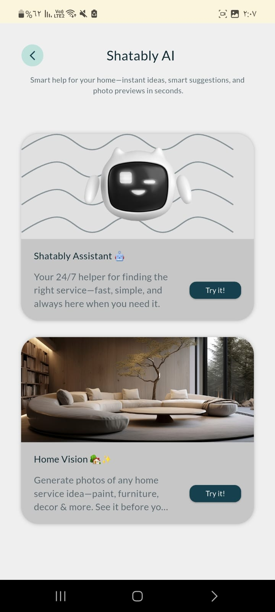
  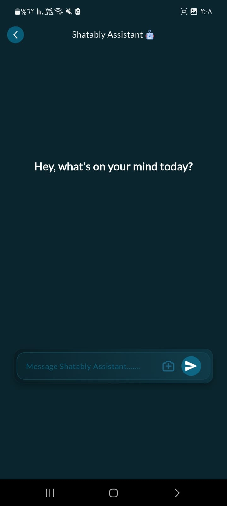

  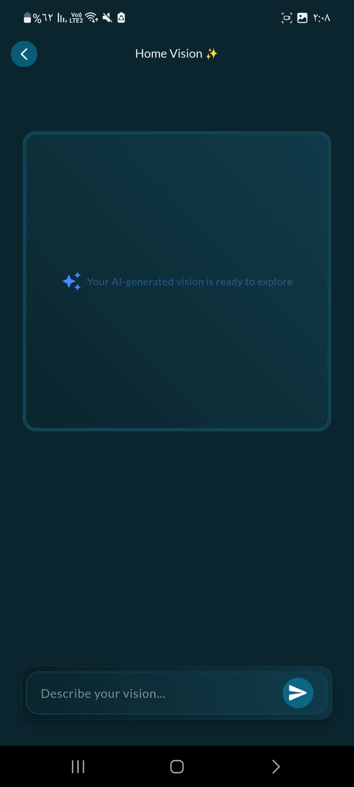

  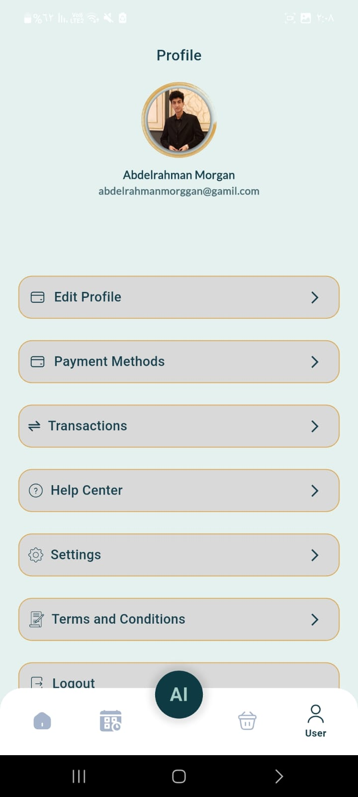

